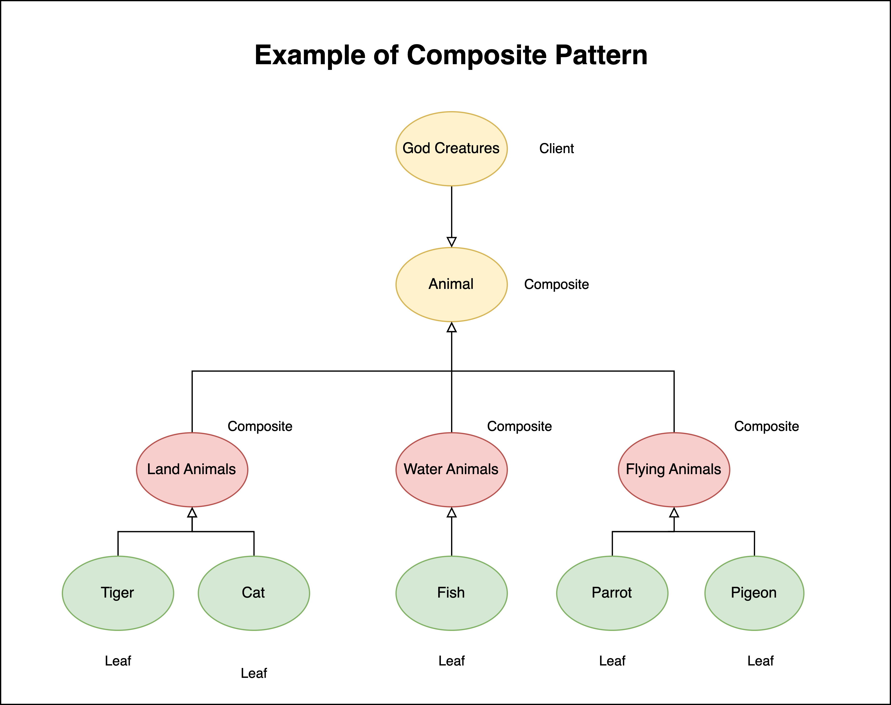
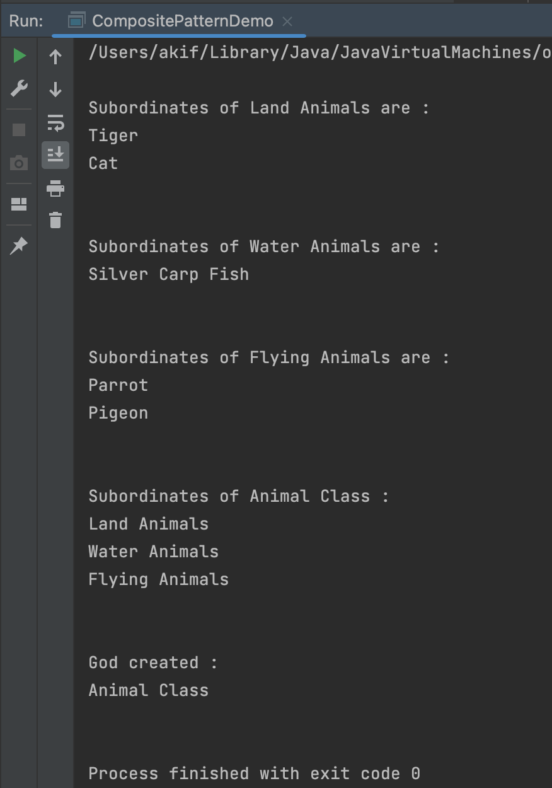

# A demonstration of Composite Design Pattern

# Course Title : Object Oriented Design and Design Patterns Lab(CSE 4122)
## Author
Akif Islam<br>
Department of CSE, University of Rajshahi<br>
iamakifislam@gmail.com<br><br><br>

## Experiment 03
<p>Write a Java program to demonstrate the implementation of a composite design pattern by using an example with a building composed of generic housing structures.</p>

## Story of the Program
<p>
Though the question asked to implement a generic housing idea with Composite Design Pattern, I 
accidentally created this program with my own idea of Animal hierarchy. This design pattern follows the basic client-component-leaf model of Composite Design Pattern. 
</p>

## Class Diagram




## How to Run?
```bash
  $javac CompositePatternDemo.java
  $java CompositePatternDemo
```


## Composite Pattern Demo Program
```java
// Creating Leaf Node for Land Animal
Tiger exampleLandAnimal_1 = new Tiger();
Cat exampleLandAnimal_2 = new Cat();

// Send/Add it to Composite Class -> Land Animal
LandAnimals landAnimals = new LandAnimals();

landAnimals.addAnimal(exampleLandAnimal_1);
landAnimals.addAnimal(exampleLandAnimal_2);
landAnimals.getSubordinates();

// Creating Leaf Node for Water Animal
SilverCarpFish exampleFish = new SilverCarpFish();
WaterAnimals waterAnimals = new WaterAnimals();
waterAnimals.addAnimal(exampleFish);
waterAnimals.getSubordinates();


// Creating Leaf Node for Flying Animal
Parrot exampleFlyingAnimal_1 = new Parrot();
Pigeon exampleFlyingAnimal_2 = new Pigeon();

FlyingAnimals flyingAnimals = new FlyingAnimals();
flyingAnimals.addAnimal(exampleFlyingAnimal_1);
flyingAnimals.addAnimal(exampleFlyingAnimal_2);
flyingAnimals.getSubordinates();

// Send it to Animal Class
Animals animals = new Animals();

animals.addAnimal(landAnimals);
animals.addAnimal(waterAnimals);
animals.addAnimal(flyingAnimals);
animals.getSubordinates();

// Send it to Client Class - God Creature
GodCreatures godCreatures = new GodCreatures();
godCreatures.addAnimal(animals);
godCreatures.getSubordinates();

```

## Output



